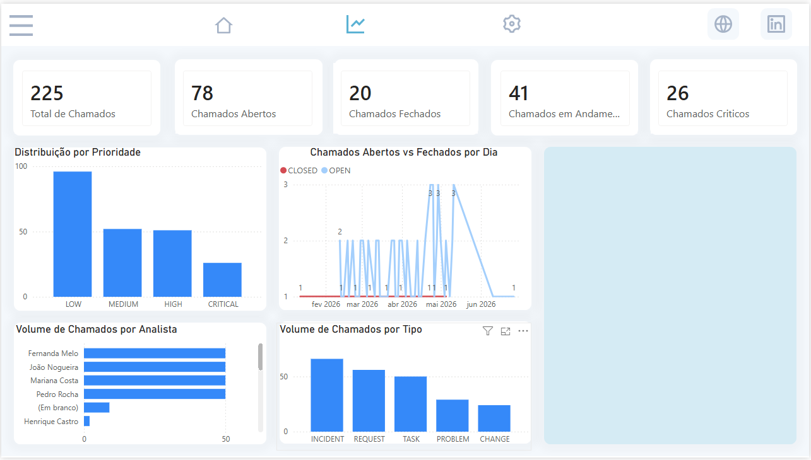
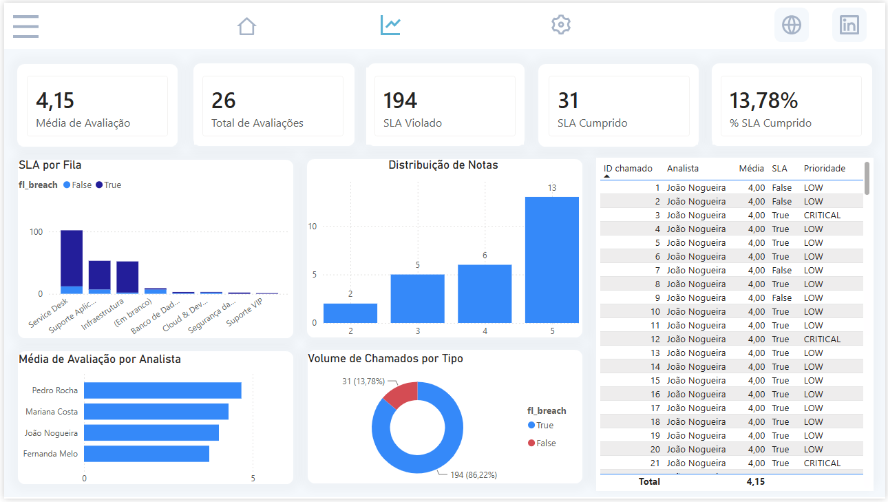

# TAPR-2026-1-ITSM

## Desenho Arquitetura

## PowerBI

# Padrão de Projeto Aplicado

## O problema

O projeto tinha 10 arquivos quase idênticos, um para cada tabela replicada do banco do ITSM para o banco analítico. Só mudava o nome da tabela, a chave e as colunas — o resto era copiado e colado.

## Padrão aplicado: Template Method

**O que resolve:** algoritmos iguais, repetidos várias vezes, mudando só alguns detalhes.

**Solução:** o algoritmo (conectar, extrair, gravar) foi escrito uma única vez numa classe base. Cada tabela virou uma subclasse pequena, só com o que é diferente dela.

**Consequências:**
- (+) Uma correção vale para todas as tabelas.
- (+) Menos chance de erro (o SQL é gerado, não escrito à mão).
- (-) Um erro na classe base afeta todas as tabelas de uma vez.
- (-) É preciso olhar a classe base para entender o algoritmo completo.

## Padrão sugerido: Strategy

Hoje toda tabela é carregada do mesmo jeito. O Strategy permitiria trocar a forma de carregar (completa, incremental, só inserir) sem criar uma subclasse nova para cada combinação.

## Resumo

| | Padrão | Papel |
|---|---|---|
| Aplicado | Template Method | Elimina a duplicação do algoritmo |
| Sugerido | Strategy | Trataria a forma de carregar cada tabela |
